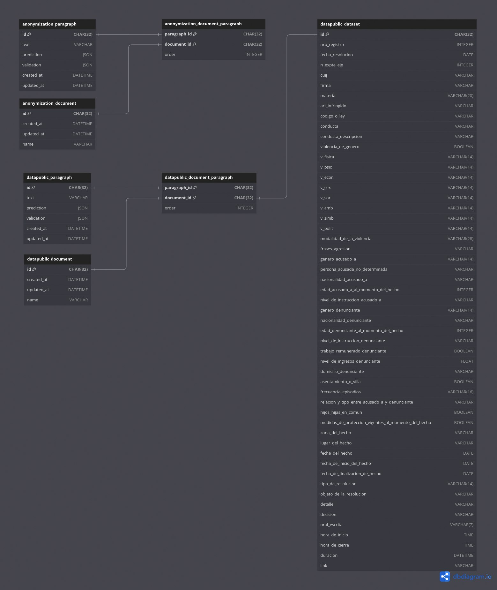

# Descripción del nuevo flujo de integración en AymurAI

En este documento, describimos brevemente el nuevo flujo de integración entre el _front-end_ y el _back-end_ de AymurAI.

## Actualización principal del back-end

Se implementó un motor de base de datos que permite persistir en disco tanto las predicciones generadas por los modelos como las validaciones manuales realizadas desde la interfaz gráfica. Esta base de datos no sólo funciona como un caché para las predicciones, sino que además permite a les usuaries recuperar la última validación manual en caso de necesitar reprocesar un documento específico.

A continuación, se detalla el nuevo flujo para cada _pipeline_ de AymurAI:

### Anonymizer

1. **Consulta inicial en la base de datos (_endpoint_ `/anonymizer/validation`):**

    Tras la extracción del texto del documento, se verifica si existe una validación guardada para cada uno de sus párrafos. El identificador utilizado es un _hash_ único generado a partir del contenido textual del párrafo.

   - **Si existe una validación previa en la tabla `anonymization_paragraph`:** se retorna dicha validación.
   - **Si no existe una validación previa:** debe dispararse el flujo de predicciones consumiendo el _endpoint_ correspondiente.

2. **Consulta de predicciones (_endpoint_ `/anonymizer/predict`):**

   - **Si la predicción para el párrafo ya existe en la tabla `anonymization_paragraph`:** se retorna.
   - **Si no existe:** se ejecuta el modelo de predicción, y los resultados se retornan y se persisten en la tabla `anonymization_paragraph`.

    > **Formato de etiquetas:** tanto las validaciones manuales como las predicciones se estructuran utilizando el formato actual de las etiquetas de AymurAI.

3. **Interfaz gráfica y validación manual:**

   Las etiquetas retornadas se muestran en la interfaz gráfica, donde pueden ser validadas manualmente. Una vez finalizada la validación, se procede con la anonimización del documento (_endpoint_ `/anonymizer/anonymize-document`).

4. **Persistencia de validaciones:**

    Al finalizar el proceso, las validaciones se escriben en la tabla `anonymization_paragraph`, ya sea creando nuevos registros para párrafos nuevos o actualizando registros existentes para párrafos previamente procesados. Esta escritura es realizada al inicio del flujo de `anonymize-document`, luego de que se indique desde la UI que el documento está listo para su anonimización. Además, en la tabla `anonymization_document` se escribe la referencia al ID del documento y el nombre del archivo correspondiente. Asimismo, el ID del documento permite recuperar los párrafos y su orden en el documento a través de la tabla `anonymization_document_paragraph`.

### Data Public

El flujo para el _pipeline_ de Data Public es similar al del Anonymizer, pero presenta diferencias importantes en cuanto a las validaciones, ya que estas no comparten el mismo formato que las predicciones originales del modelo. En este caso, las validaciones se realizan a nivel general del documento (no por párrafo) y se llevan a cabo manualmente en la sección lateral derecha de la UI, donde se definen los campos que serán volcados al dataset público. A diferencia del _pipeline_ de anonimización, las predicciones siempre son necesarias para resaltar los campos detectados en el texto, incluso cuando ya existen validaciones realizadas, ya que estas no son modificaciones directas sobre las entidades reconocidas por el modelo.

1. **Consulta inicial en la base de datos (_endpoint_ `/datapublic/dataset/{document_id}`):**

   Tras la extracción del texto del documento, se verifica si existe una validación general para el documento.

   - **Si existe una validación previa para el documento en la tabla `datapublic_dataset`:** se retorna dicha validación.

2. **Flujo de predicciones (_endpoint_ `/datapublic/predict`):**

    A su vez, se consulta si existen predicciones guardadas para cada uno de los párrafos:

    - **Si existe una predicción previa para cada párrafo en la tabla `datapublic_paragraph`:** se retorna dicha predicción.

    - **Si no existe:** se ejecuta el modelo de predicción, y los resultados se retornan y se persisten en la tabla `datapublic_paragraph`.

    > **Formato de etiquetas:** las predicciones se estructuran utilizando el formato actual de las etiquetas de AymurAI. Las validaciones, sin embargo, tienen un formato distinto, **equivalente al de las filas del dataset público**. Es necesario tener presente esto para poder integrar correctamente con el _front-end_ los campos validados persistidos en la base de datos.

3. **Interfaz gráfica y validación manual:**

   Una vez finalizadas las consultas a la base de datos y el flujo de predicciones, las etiquetas retornadas se muestran en la interfaz gráfica, donde pueden ser revisadas y validadas manualmente. Posteriormente, las nuevas validaciones se persisten en la tabla `datapublic_dataset` haciendo un _post_ contra el _endpoint_ `/datapublic/dataset`, ya sea creando nuevos registros para documentos nuevos o actualizando registros existentes para documentos previamente procesados. Esta escritura debe realizarse una vez que desde la UI se confirma que los datos extraídos del documento son correctos.

#### Requerimientos a la UI

Para la correcta persistencia de los datos (por ejemplo, para hacer evaluaciones o futuros entrenamientos de los modelos), se necesita que la UI envíe los datos corregidos a la API. Esto puede ser resumido en un _endpoint_ de "compilación" al final del proceso de validación. Este _endpoint_ sería equivalente al `anonymization/anonymize-document`

## Esquema de la base de datos

