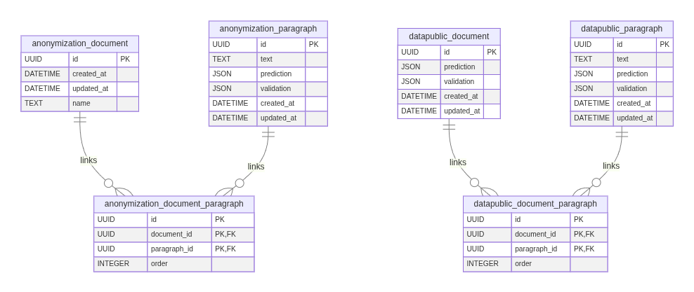

# Base de Datos Interna
Idioma: [English](../../database/README.md) | **Español**

Este documento describe la persistencia interna usada por la API en runtime.

## Motor y migraciones
- ORM: `SQLModel` (backend `sqlalchemy`)
- Herramienta de migración: Alembic
- Setting de runtime: `SQLALCHEMY_DATABASE_URI`
- URI por defecto: `sqlite:////resources/cache/sqlite/database.db`
- Comportamiento al iniciar:
  1. La API valida conectividad de DB.
  2. Si falta el archivo SQLite, crea los directorios padre.
  3. Ejecuta `alembic upgrade head` al iniciar.

Código relacionado:
- `aymurai/settings.py`
- `aymurai/api/startup/database.py`
- `aymurai/api/main.py`
- `aymurai/database/versions/13f78d08e925_create_database.py`

## Diagrama ER

Fuente editable: [../../database/schema.mmd](../../database/schema.mmd)

## Tablas

### `anonymization_document`
| Columna | Tipo | Nulo | Notas |
|---|---|---|---|
| `id` | `UUID` | no | Primary key |
| `created_at` | `DATETIME` | no | Default server `CURRENT_TIMESTAMP` |
| `updated_at` | `DATETIME` | sí | Se actualiza ante cambios |
| `name` | `TEXT` | no | Nombre de archivo original |

### `anonymization_paragraph`
| Columna | Tipo | Nulo | Notas |
|---|---|---|---|
| `id` | `UUID` | no | Primary key, derivada del hash del texto |
| `text` | `TEXT` | no | Texto normalizado del párrafo |
| `prediction` | `JSON` | sí | Predicciones del modelo (`list[DocLabel]`) |
| `validation` | `JSON` | sí | Etiquetas validadas manualmente (`list[DocLabel]`) |
| `created_at` | `DATETIME` | no | Default server `CURRENT_TIMESTAMP` |
| `updated_at` | `DATETIME` | sí | Se actualiza ante cambios |

### `anonymization_document_paragraph`
| Columna | Tipo | Nulo | Notas |
|---|---|---|---|
| `id` | `UUID` | no | Identificador del vínculo |
| `document_id` | `UUID` | no | FK -> `anonymization_document.id` |
| `paragraph_id` | `UUID` | no | FK -> `anonymization_paragraph.id` |
| `order` | `INTEGER` | sí | Orden del párrafo en documento origen |

La clave primaria es compuesta por `id`, `document_id`, `paragraph_id`.

### `datapublic_document`
| Columna | Tipo | Nulo | Notas |
|---|---|---|---|
| `id` | `UUID` | no | Primary key (identificador del documento) |
| `prediction` | `JSON` | sí | Payload reservado de predicción a nivel documento; el router público actual no lo escribe |
| `validation` | `JSON` | sí | Payload de validación a nivel documento |
| `created_at` | `DATETIME` | no | Default server `CURRENT_TIMESTAMP` |
| `updated_at` | `DATETIME` | sí | Se actualiza ante cambios |

### `datapublic_paragraph`
| Columna | Tipo | Nulo | Notas |
|---|---|---|---|
| `id` | `UUID` | no | Primary key, derivada del hash del texto |
| `text` | `TEXT` | no | Texto normalizado del párrafo |
| `prediction` | `JSON` | sí | Predicciones del modelo (`list[DocLabel]`) |
| `validation` | `JSON` | sí | Reservado para validación por párrafo; la ruta pública hoy existe solo como lógica legacy comentada |
| `created_at` | `DATETIME` | no | Default server `CURRENT_TIMESTAMP` |
| `updated_at` | `DATETIME` | sí | Se actualiza ante cambios |

### `datapublic_document_paragraph`
| Columna | Tipo | Nulo | Notas |
|---|---|---|---|
| `id` | `UUID` | no | Identificador del vínculo |
| `document_id` | `UUID` | no | FK -> `datapublic_document.id` |
| `paragraph_id` | `UUID` | no | FK -> `datapublic_paragraph.id` |
| `order` | `INTEGER` | sí | Orden del párrafo en documento origen |

La clave primaria es compuesta por `id`, `document_id`, `paragraph_id`.

## Mapeo endpoint -> persistencia

### Anonymizer
- `POST /anonymizer/predict`
  - Lee `anonymization_paragraph` por UUID de párrafo.
  - Escribe `anonymization_paragraph.prediction` cuando el cache está activo.
- `POST /anonymizer/disambiguate`
  - Escribe predicciones desambiguadas en `anonymization_paragraph.prediction`.
- `POST /anonymizer/validation`
  - Lee `anonymization_paragraph.validation`.
- `POST /anonymizer/anonymize-document`
  - Escribe `anonymization_paragraph.validation`.
  - Crea `anonymization_document` con clave derivada del hash del contenido binario subido.
  - Crea vínculos en `anonymization_document_paragraph`.

### Data-public
- `POST /datapublic/predict/{document_id}`
  - Usa el `document_id` provisto por el cliente como primary key del documento.
  - Asegura existencia de `datapublic_document` cuando `use_cache=true`.
  - Escribe `datapublic_paragraph.prediction` cuando `use_cache=true`.
  - Escribe vínculo en `datapublic_document_paragraph` cuando `use_cache=true`.
- `GET /datapublic/validation/document/{document_id}`
  - Lee `datapublic_document.validation`.
- `POST /datapublic/validation/document/{document_id}`
  - Hace upsert de `datapublic_document.validation`.

## Nota legacy
Los módulos de rutas para CRUD de dataset (`/datapublic/dataset/*`) existen en código pero no están montados en el router público. No deben tratarse como API pública activa hasta su exposición en `core.router`.
