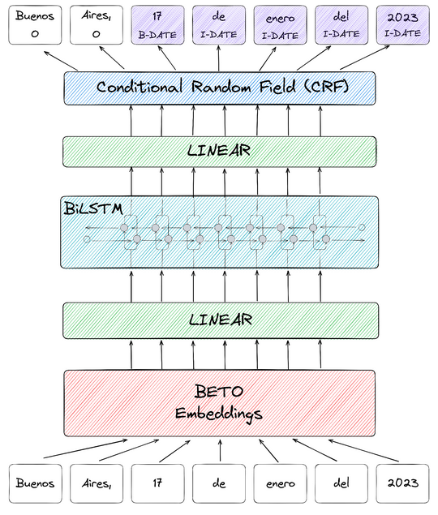

Idioma: [English](../../models/flair-model-card.md) | **Español**

# Descripción del modelo
<p style="text-align:center;">

</p>

Siguiendo las guías de Flair para entrenar un modelo de NER, este modelo se entrenó sobre [embeddings BETO](https://huggingface.co/dccuchile/bert-base-spanish-wwm-uncased), una versión en español de BERT entrenada sobre un corpus en español, con una arquitectura BiLSTM-CRF.

Este modelo fue desarrollado por [{ collective.ai }](https://collectiveai.io) como parte del proyecto [AymurAI](https://aymurai.info) de [DataGenero](https://datagenero.org).
Actualmente se usa como componente NER del pipeline de producción `datapublic`.

# Usos previstos y limitaciones
AymurAI está pensado como una herramienta para abordar la falta de transparencia en el sistema judicial en relación con casos de violencia de género (VG) en América Latina. El objetivo es aumentar los niveles de reporte, construir confianza en el sistema de justicia y mejorar el acceso a la justicia para mujeres y personas LGBTIQ+. AymurAI genera y mantiene datasets anonimizados a partir de sentencias judiciales para comprender la violencia de género y apoyar el diseño de políticas públicas, además de contribuir a campañas de colectivos feministas.

Las capacidades de AymurAI se limitan a la recolección y análisis semiautomatizados de datos, y sus resultados pueden estar sujetos a limitaciones como la calidad y consistencia de los datos, posibles sesgos del modelo de IA y la disponibilidad de la información. Además, la efectividad de AymurAI para abordar la falta de transparencia del sistema judicial y mejorar el acceso a la justicia también puede depender de otros factores, como el nivel de cooperación de funcionarios judiciales y el contexto cultural y político más amplio.

Este modelo fue entrenado con un dataset cerrado proveniente de un juzgado penal argentino. Está diseñado para identificar y extraer información relevante de sentencias vinculadas con casos de violencia de género. El uso de un dataset específico de dominio, proveniente de un juzgado penal argentino, hace que el modelo esté ajustado al contexto jurídico y cultural concreto, lo que permite resultados más precisos. Sin embargo, esto también implica que el modelo puede no ser aplicable o efectivo en otros países o regiones con sistemas jurídicos o normas culturales diferentes.

# Uso
## Cómo usar el modelo en Flair

Requiere **[Flair](https://github.com/flairNLP/flair/)**.
Instalación: `pip install flair`

```python
from flair.data import Sentence
from flair.models import SequenceTagger

# load tagger
tagger = SequenceTagger.load("aymurai/flair-ner-spanish-judicial")

# make example sentence
sentence = Sentence("1. DECLARAR EXTINGUIDA LA ACCIÓN PENAL en este caso por cumplimiento de la suspensión del proceso a prueba, y SOBRESEER a EZEQUIEL CAMILO MARCONNI, DNI 11.222.333, en orden a los delitos de lesiones leves agravadas, amenazas simples y agravadas por el uso de armas.")

# predict NER tags
tagger.predict(sentence)

# print sentence
print(sentence)

# print predicted NER spans
print('The following NER tags are found:')
# iterate over entities and print
for entity in sentence.get_spans('ner'):
    print(entity)
```

Esto produce una salida como la siguiente:

```text
Span[2:11]: "EXTINGUIDA LA ACCIÓN PENAL en este caso por cumplimiento" → DETALLE (0.5498)
Span[13:18]: "suspensión del proceso a prueba" → OBJETO_DE_LA_RESOLUCION (0.5647)
Span[20:21]: "SOBRESEER" → DETALLE (0.7766)
Span[22:25]: "EZEQUIEL CAMILO MARCONNI" → NOMBRE (0.6454)
Span[35:36]: "lesiones" → CONDUCTA (0.9457)
Span[36:38]: "leves agravadas" → CONDUCTA_DESCRIPCION (0.8818)
Span[39:40]: "amenazas" → CONDUCTA (0.956)
Span[40:48]: "simples y agravadas por el uso de armas" → CONDUCTA_DESCRIPCION (0.6866)
```

## Uso del modelo en un pipeline de AymurAI
También podés ejecutar el modelo a través de un pipeline de AymurAI.

```python
from aymurai.pipeline import AymurAIPipeline

pipeline = AymurAIPipeline.load("/resources/pipelines/production/datapublic")

item = {
    'path': 'dummy',
    'data': {
        'doc.text': "1. DECLARAR EXTINGUIDA LA ACCIÓN PENAL en este caso por cumplimiento de la suspensión del proceso a prueba, y SOBRESEER a EZEQUIEL CAMILO MARCONNI, DNI 11.222.333, en orden a los delitos de lesiones leves agravadas, amenazas simples y agravadas por el uso de armas."
    }
}

processed = pipeline.preprocess([item])
processed = pipeline.predict_single(processed[0])
processed = pipeline.postprocess([processed])

print(processed[0]["predictions"]["entities"])
```

# Entidades y métricas
## Descripción
Consultá el catálogo de entidades de datapublic ([en](../../entities/datapublic/README.md)|[es](../entities/datapublic/README.md)).

Para una descripción completa de las entidades consideradas por AymurAI, ver el [Glosario para el dataset con perspectiva de género](https://docs.google.com/document/d/123B9T2abCEqBaxxOl5c7HBJZRdIMtKDWo6IKHIVil04/edit), elaborado por [DataGenero](https://datagenero.org) (solo en español).

## Datos
El modelo fue entrenado con un dataset de 1200 resoluciones judiciales de un juzgado penal argentino.

Dada la naturaleza de los datos (datos personales, características de la denuncia y protección de víctimas), los documentos se mantienen privados.

### Lista de personas colaboradoras en la anotación
El dataset fue anotado manualmente por:
* Diego Scopetta
* Franny Rodriguez Gerzovich ([email](mailto:fraanyrodriguez@gmail.com)|[linkedin](https://www.linkedin.com/in/francescarg))
* Laura Barreiro
* Matías Sosa
* Maximiliano Sosa
* Patricia Sandoval
* Santiago Bezchinsky ([email](mailto:santibezchinsky@gmail.com)|[linkedin](https://www.linkedin.com/in/santiago-bezchinsky))
* Zoe Rodriguez Gerzovich

## Métricas

| label                                               | precision | recall | f1-score |
|-----------------------------------------------------|-----------|--------|----------|
| FECHA_DE_NACIMIENTO                                 | 0.98      | 0.99   | 0.99     |
| FECHA_RESOLUCION                                    | 0.95      | 0.98   | 0.96     |
| NACIONALIDAD                                        | 0.94      | 0.98   | 0.96     |
| GENERO                                              | 1.00      | 0.50   | 0.67     |
| HORA_DE_INICIO                                      | 0.98      | 0.92   | 0.95     |
| NOMBRE                                              | 0.94      | 0.95   | 0.95     |
| FRASES_AGRESION                                     | 0.90      | 0.98   | 0.94     |
| HORA_DE_CIERRE                                      | 0.90      | 0.92   | 0.91     |
| NIVEL_INSTRUCCION                                   | 0.85      | 0.94   | 0.90     |
| N_EXPTE_EJE                                         | 0.85      | 0.93   | 0.89     |
| TIPO_DE_RESOLUCION                                  | 0.63      | 0.93   | 0.75     |
| VIOLENCIA_DE_GENERO                                 | 0.49      | 0.59   | 0.54     |
| RELACION_Y_TIPO_ENTRE_ACUSADO/A_Y_DENUNCIANTE       | 0.93      | 0.76   | 0.84     |
| HIJOS_HIJAS_EN_COMUN                                | 0.47      | 0.57   | 0.52     |
| MODALIDAD_DE_LA_VIOLENCIA                           | 0.57      | 0.56   | 0.57     |
| FECHA_DEL_HECHO                                     | 0.83      | 0.83   | 0.83     |
| CONDUCTA                                            | 0.79      | 0.67   | 0.73     |
| ART_INFRINGIDO                                      | 0.76      | 0.74   | 0.75     |
| DETALLE                                             | 0.53      | 0.37   | 0.43     |
| OBJETO_DE_LA_RESOLUCION                             | 0.60      | 0.78   | 0.68     |
| CONDUCTA_DESCRIPCION                                | 0.54      | 0.43   | 0.48     |
| LUGAR_DEL_HECHO                                     | 0.75      | 0.47   | 0.58     |
| EDAD_AL_MOMENTO_DEL_HECHO                           | 0.50      | 0.20   | 0.29     |
| PERSONA_ACUSADA_NO_DETERMINADA                      | 0.71      | 0.19   | 0.30     |
|                                                     |           |        |          |
| macro avg                                           | 0.77      | 0.72   | 0.73     |

# Cita
Por favor citá [el siguiente paper](https://drive.google.com/file/d/1P-hW0JKXWZ44Fn94fDVIxQRTExkK6m4Y/view) al utilizar AymurAI:

```bibtex
@techreport{feldfeber2022,
  author      = {Feldfeber, Ivana and Quiroga, Yasm'{\i}n Bel'{e}n and Guevara, Clarissa and Ciolfi Felice, Marianela},
  title       = {Feminisms in Artificial Intelligence: Automation Tools towards a Feminist Judiciary Reform in Argentina and Mexico},
  institution = {DataGenero},
  year        = {2022},
  url         = {https://drive.google.com/file/d/1P-hW0JKXWZ44Fn94fDVIxQRTExkK6m4Y/view}
}
```
