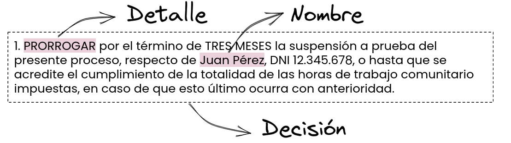

# Pipeline

The AymurAI pipeline is written in a modular way, each step is independent and can be replaced by another one. This allows us to easily change the models or the way in which the information is processed.
It's made up of three main steps: preprocessing, inference and postprocessing.
The preprocessing step is in charge of dividing the court rulings into paragraphs and normalizing their text. The inference step is in charge of extracting the information from the paragraphs. Finally, the postprocessing step is in charge of filtering out irrelevant decisions and formatting the text.
# Preprocessing
The flow of information in the system starts with a pre-processing step for the court rulings, where the documents are divided into paragraphs and their text is normalized. This normalization process involves the unification of multiple spaces and the removal of accents and/or special characters .
In this way, the paragraphs become the minimum unit of analysis, and predictions are generated in parallel and independently from one another.

# Inference

The fundamental piece of the AymurAI backend is the AI models. They are in charge of extracting information from court rulings.
For their development, we use the following work frameworks:
The NER model was developed using [Flair](https://github.com/flairNLP/flair), a Python library created by Humboldt - University of Berlin focused on natural language processing models. Flair is based on PyTorch, one of the main artificial intelligence frameworks, and allows integration with Transformers, another of the main libraries of natural language processing models.
For the decision model we use PyTorch natively.

Each paragraph is processed by these models, and the results are combined.

Check out the [model cards](#model-cards) for more information about the models, and the [model training](#model-training-notebooks) section for more information about how the models were trained.

# Postprocessing
Once the inference is made, the predictions are postprocessed in order to obtain the final results.
This process involves:
* Subcategorization extraction or classification
* Filtering out irrelevant decisions
* Text formatting

## Subcategorization
* Regex
Regular expressions allow us to identify some subcategories whose texts tend to be repeated following very marked patterns.

* Sentence Similarity
Entities with many subcategories, and less well represented, are identified using sentence similarity. The Universal Sentence Encoder Multilingual QA model, published by Google, allows us to encode the text identified as belonging to certain categories in order to then calculate a semantic similarity score with respect to each possible subcategory and thus generate a ranking of candidates, ordered from highest to lowest similarity.

## Text Formating
The NER model extract non-structured information from the text. Dates and times are reformatted to a standard format.

## Filters
Many of the decisions that are extracted by the models are not relevant to the user. Relevant decisions are those that contain a specific type of information, such as presence of other relevant entities (e.i DETALLE)

# Models
## Model cards
* [Flair NER Spanish Judicial](./flair-model-card.md)
* [Decision Text Classification](./decision-model-card.md)

# Model Training Notebooks
* [Flair NER Spanish Judicial](../../notebooks/experiments/ner/flair/)
* [Decision Text Classification](../../notebooks/experiments/decision/)
