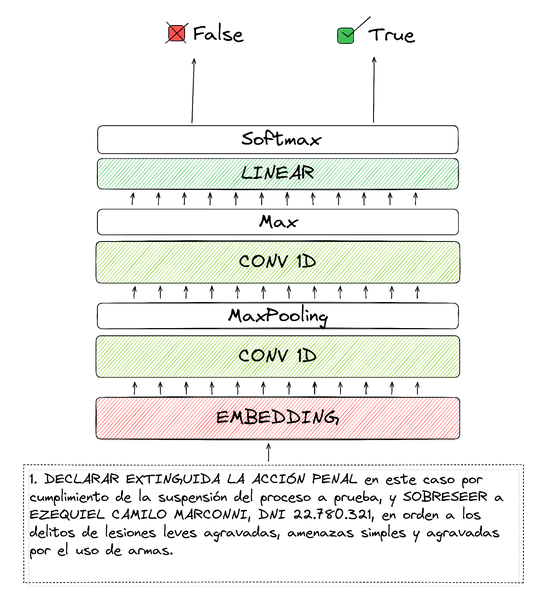
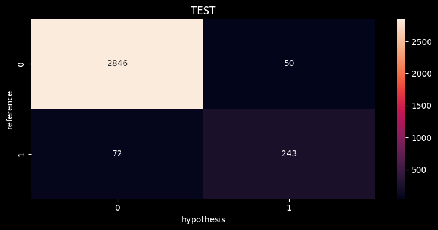

# Model Description
<p style="text-align:center;">

</p>

This model was developed by [{ collective.ai }](https://collectiveai.io) as part of the [AymurAI](https://aymurai.info) project by [DataGenero](https://datagenero.org).


# Intended uses & limitations
AymurAI is intended to be used as a tool to address the lack of transparency in the judicial system regarding gender-based violence (GBV) cases in Latin America. The goal is to increase report levels, build trust in the justice system, and improve access to justice for women and LGBTIQ+ people. AymurAI will generate and maintain anonymized datasets from legal rulings to understand GBV and support policy making, and also contribute to feminist collectives' campaigns.

AymurAI is still a prototype and is only being implemented in Argentina and Mexico. Its capabilities are limited to semi-automated data collection and analysis, and the results may be subject to limitations such as the quality and consistency of the data, potential biases in the AI model, and the availability of the data. Additionally, the effectiveness of AymurAI in addressing the lack of transparency in the judicial system and improving access to justice may also depend on other factors such as the level of cooperation from court officials and the broader cultural and political context.

This model was trained with a closed dataset from an Argentine criminal court. It's is designed to identify and extract relevant information from court sentences related to GBV cases. The use of a domain specific dataset from an Argentine criminal court ensures that the model is tailored to the specific legal and cultural context, allowing for more accurate results. However, it also means that the model may not be applicable or effective in other countries or regions with different legal systems or cultural norms.

# Usage
## How to use the model in torch


```python

from aymurai.models.decision.torch.binregex import DecisionConv1dBinRegex

model = DecisionConv1dBinRegex(
    tokenizer_path="https://drive.google.com/uc?id=1eljQOinpObdfBREIKxVnC5Y2g_sbhPHT&confirm=true",
    model_checkpoint="https://drive.google.com/uc?id=19_YmBJnO06iS0qW8ak0zl0EIsJYin8kQ&confirm=true",
    device="cpu",
)

text = "1. DECLARAR EXTINGUIDA LA ACCIÓN PENAL en este caso por cumplimiento de la suspensión del proceso a prueba, y SOBRESEER a EZEQUIEL CAMILO MARCONNI, DNI 11.222.333, en orden a los delitos de lesiones leves agravadas, amenazas simples y agravadas por el uso de armas."

input_ids = model.tokenizer.encode_batch([text])
input_ids.shape

# The model return the logsoftmax of the probabilities of the classes
probabilities = model.model(input_ids).exp().detach().numpy()
probabilities


```

This yields the following output:
```
array([[2.2457261e-05, 9.9997759e-01]], dtype=float32)
```
The first column is the probability of the text not being a decision, and the second column is the probability of the text being a decision. For this example, the model predicts that the text is a decision with a probability of 99.99%.

## Using the model in aymurai pipeline
You also can run the model directly in the aymurai pipeline.

```python
from aymurai.pipeline import AymurAIPipeline
from aymurai.models.flair.utils import FlairTextNormalize
from aymurai.models.decision.torch.binregex import DecisionConv1dBinRegex

config = {
    "preprocess": [
        [
            "aymurai.models.flair.utils.FlairTextNormalize",
            {}
        ]
    ],
    "models": [

        [
            "aymurai.models.decision.torch.binregex.DecisionConv1dBinRegex",
            {
                "tokenizer_path": "https://drive.google.com/uc?id=1eljQOinpObdfBREIKxVnC5Y2g_sbhPHT&confirm=true",
                "model_checkpoint": "https://drive.google.com/uc?id=19_YmBJnO06iS0qW8ak0zl0EIsJYin8kQ&confirm=true",
                "device": "cpu",
                "threshold": 0.5,
                "return_only_with_detalle": true
            }
        ]
    ],
    "postprocess": [
    ],
    "use_cache": false
}


pipeline = AymurAIPipeline.load("/resources/pipelines/production/full-paragraph")

item = {
    'path': 'dummy',
    'data': {
        'doc.text': "1. DECLARAR EXTINGUIDA LA ACCIÓN PENAL en este caso por cumplimiento de la suspensión del proceso a prueba, y SOBRESEER a EZEQUIEL CAMILO MARCONNI, DNI 11.222.333, en orden a los delitos de lesiones leves agravadas, amenazas simples y agravadas por el uso de armas."
    }
}

pipeline.predict([item])


```


# Entities and metrics
## Description
This model only considers the classification of paragraphs being decisions or not.

For the complete list of entities, please refer to the entities' description table ([en](../data/en/entities-table.md)|[es](../data/es/entities-table.md)).

For a complete description about entities considered by AymurAI, refer to the [Glossary for the Dataset with gender perspective](https://docs.google.com/document/d/123B9T2abCEqBaxxOl5c7HBJZRdIMtKDWo6IKHIVil04/edit) written by [DataGenero](https://datagenero.org) (spanish only)


## Data
The model was trained with a dataset of 1200 legal rulings from an Argentine criminal court.

Due to the nature of the data (personal data, complaint characteristics and victim protection) the documents are kept private.
### List of annotation contributors
The dataset was manually annotated by:
* Diego Scopetta
* Franny Rodriguez Gerzovich ([email](fraanyrodriguez@gmail.com)|[linkedin](https://www.linkedin.com/in/francescarg))
* Laura Barreiro
* Matías Sosa
* Maximiliano Sosa
* Patricia Sandoval
* Santiago Bezchinsky ([email](santibezchinsky@gmail.com)|[linkedin](https://www.linkedin.com/in/santiago-bezchinsky))
* Zoe Rodriguez Gerzovich
## Metrics

<p style="text-align:center;">

</p>

Class 0: Not a decision
Class 1: Decision


## Citation
Please cite [the following paper](https://drive.google.com/file/d/1P-hW0JKXWZ44Fn94fDVIxQRTExkK6m4Y/view) when using AymurAI:

```bibtex
@techreport{feldfeber2022,
    author      = "Feldfeber, Ivana and Quiroga, Yasmín Belén  and Guevara, Clarissa  and Ciolfi Felice, Marianela",
    title       = "Feminisms in Artificial Intelligence:  Automation Tools towards a Feminist Judiciary Reform in Argentina and Mexico",
    institution = "DataGenero",
    year        = "2022",
    url         = "https://drive.google.com/file/d/1P-hW0JKXWZ44Fn94fDVIxQRTExkK6m4Y/view"
}
```
