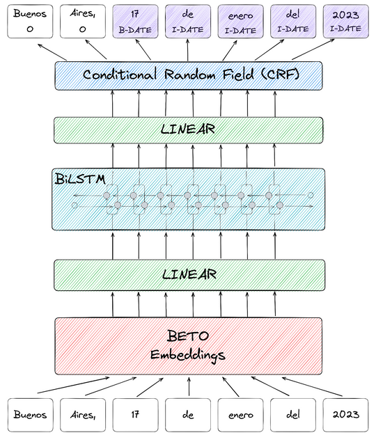

# Model Description
<p style="text-align:center;">

</p>

Following the FLAIR guidelines for training a NER model, we trained a model on top of [BETO embeddings](https://huggingface.co/dccuchile/bert-base-spanish-wwm-uncased) (a spanish version of BERT trained in a spanish corpus) and a BiLSTM-CRF architecture.

This model was developed by [{ collective.ai }](https://collectiveai.io) as part of the [AymurAI](https://aymurai.info) project by [DataGenero](https://datagenero.org).


# Intended uses & limitations
AymurAI is intended to be used as a tool to address the lack of transparency in the judicial system regarding gender-based violence (GBV) cases in Latin America. The goal is to increase report levels, build trust in the justice system, and improve access to justice for women and LGBTIQ+ people. AymurAI will generate and maintain anonymized datasets from legal rulings to understand GBV and support policy making, and also contribute to feminist collectives' campaigns.

AymurAI is still a prototype and is only being implemented in Argentina and Mexico. Its capabilities are limited to semi-automated data collection and analysis, and the results may be subject to limitations such as the quality and consistency of the data, potential biases in the AI model, and the availability of the data. Additionally, the effectiveness of AymurAI in addressing the lack of transparency in the judicial system and improving access to justice may also depend on other factors such as the level of cooperation from court officials and the broader cultural and political context.

This model was trained with a closed dataset from an Argentine criminal court. It's is designed to identify and extract relevant information from court sentences related to GBV cases. The use of a domain specific dataset from an Argentine criminal court ensures that the model is tailored to the specific legal and cultural context, allowing for more accurate results. However, it also means that the model may not be applicable or effective in other countries or regions with different legal systems or cultural norms.

# Usage
## How to use the model in Flair

Requires: **[Flair](https://github.com/flairNLP/flair/)**.
Install it with `pip install flair`

```python
from flair.data import Sentence
from flair.models import SequenceTagger

# load tagger
tagger = SequenceTagger.load("aymurai/flair-ner-spanish-judicial")

# make example sentence
sentence = Sentence("1. DECLARAR EXTINGUIDA LA ACCIÓN PENAL en este caso por cumplimiento de la suspensión del proceso a prueba, y SOBRESEER a EZEQUIEL CAMILO MARCONNI, DNI 11.222.333, en orden a los delitos de lesiones leves agravadas, amenazas simples y agravadas por el uso de armas.")

# predict NER tags
tagger.predict(sentence)

# print sentence
print(sentence)

# print predicted NER spans
print('The following NER tags are found:')
# iterate over entities and print
for entity in sentence.get_spans('ner'):
    print(entity)

```

This yields the following output:
```
Span[2:11]: "EXTINGUIDA LA ACCIÓN PENAL en este caso por cumplimiento" → DETALLE (0.5498)
Span[13:18]: "suspensión del proceso a prueba" → OBJETO_DE_LA_RESOLUCION (0.5647)
Span[20:21]: "SOBRESEER" → DETALLE (0.7766)
Span[22:25]: "EZEQUIEL CAMILO MARCONNI" → NOMBRE (0.6454)
Span[35:36]: "lesiones" → CONDUCTA (0.9457)
Span[36:38]: "leves agravadas" → CONDUCTA_DESCRIPCION (0.8818)
Span[39:40]: "amenazas" → CONDUCTA (0.956)
Span[40:48]: "simples y agravadas por el uso de armas" → CONDUCTA_DESCRIPCION (0.6866)
```

## Using the model in aymurai pipeline
You also can run the model directly in the aymurai pipeline.

```python
from aymurai.pipeline import AymurAIPipeline
from aymurai.models.flair.utils import FlairTextNormalize
from aymurai.models.flair.core import FlairModel

config = {
    "preprocess": [
        [
            "aymurai.models.flair.utils.FlairTextNormalize",
            {}
        ]
    ],
    "models": [
        [
            "aymurai.models.flair.core.FlairModel",
            {
                "basepath": "https://drive.google.com/uc?id=1QJYkegv_P3d27FyRLabIUiw9154ur9-I&confirm=true",
                "split_doc": false,
                "device": "cpu"
            }
        ]
    ],
    "postprocess": [],
    "use_cache": false
}
}


pipeline = AymurAIPipeline.load("/resources/pipelines/production/full-paragraph")

item = {
    'path': 'dummy',
    'data': {
        'doc.text': "1. DECLARAR EXTINGUIDA LA ACCIÓN PENAL en este caso por cumplimiento de la suspensión del proceso a prueba, y SOBRESEER a EZEQUIEL CAMILO MARCONNI, DNI 11.222.333, en orden a los delitos de lesiones leves agravadas, amenazas simples y agravadas por el uso de armas."
    }
}

pipeline.predict([item])


```


# Entities and metrics
## Description
Please refer to the entities' description table ([en](../data/en/entities-table.md)|[es](../data/es/entities-table.md)).

For a complete description about entities considered by AymurAI, refer to the [Glossary for the Dataset with gender perspective](https://docs.google.com/document/d/123B9T2abCEqBaxxOl5c7HBJZRdIMtKDWo6IKHIVil04/edit) written by [DataGenero](https://datagenero.org) (spanish only)

## Data
The model was trained with a dataset of 1200 legal rulings from an Argentine criminal court.

Due to the nature of the data (personal data, complaint characteristics and victim protection) the documents are kept private.
### List of annotation contributors
The dataset was manually annotated by:
* Diego Scopetta
* Franny Rodriguez Gerzovich ([email](fraanyrodriguez@gmail.com)|[linkedin](https://www.linkedin.com/in/francescarg))
* Laura Barreiro
* Matías Sosa
* Maximiliano Sosa
* Patricia Sandoval
* Santiago Bezchinsky ([email](santibezchinsky@gmail.com)|[linkedin](https://www.linkedin.com/in/santiago-bezchinsky))
* Zoe Rodriguez Gerzovich
## Metrics

| label                                               | precision | recall | f1-score |
|-----------------------------------------------------|-----------|--------|----------|
| FECHA_DE_NACIMIENTO                                 | 0.98      | 0.99   | 0.99     |
| FECHA_RESOLUCION                                    | 0.95      | 0.98   | 0.96     |
| NACIONALIDAD                                        | 0.94      | 0.98   | 0.96     |
| GENERO                                              | 1.00      | 0.50   | 0.67     |
| HORA_DE_INICIO                                      | 0.98      | 0.92   | 0.95     |
| NOMBRE                                              | 0.94      | 0.95   | 0.95     |
| FRASES_AGRESION                                     | 0.90      | 0.98   | 0.94     |
| HORA_DE_CIERRE                                      | 0.90      | 0.92   | 0.91     |
| NIVEL_INSTRUCCION                                   | 0.85      | 0.94   | 0.90     |
| N_EXPTE_EJE                                         | 0.85      | 0.93   | 0.89     |
| TIPO_DE_RESOLUCION                                  | 0.63      | 0.93   | 0.75     |
| VIOLENCIA_DE_GENERO                                 | 0.49      | 0.59   | 0.54     |
| RELACION_Y_TIPO_ENTRE_ACUSADO/A_Y_DENUNCIANTE       | 0.93      | 0.76   | 0.84     |
| HIJOS_HIJAS_EN_COMUN                                | 0.47      | 0.57   | 0.52     |
| MODALIDAD_DE_LA_VIOLENCIA                           | 0.57      | 0.56   | 0.57     |
| FECHA_DEL_HECHO                                     | 0.83      | 0.83   | 0.83     |
| CONDUCTA                                            | 0.79      | 0.67   | 0.73     |
| ART_INFRINGIDO                                      | 0.76      | 0.74   | 0.75     |
| DETALLE                                             | 0.53      | 0.37   | 0.43     |
| OBJETO_DE_LA_RESOLUCION                             | 0.60      | 0.78   | 0.68     |
| CONDUCTA_DESCRIPCION                                | 0.54      | 0.43   | 0.48     |
| LUGAR_DEL_HECHO                                     | 0.75      | 0.47   | 0.58     |
| EDAD_AL_MOMENTO_DEL_HECHO                           | 0.50      | 0.20   | 0.29     |
| PERSONA_ACUSADA_NO_DETERMINADA                      | 0.71      | 0.19   | 0.30     |
|                                                     |           |        |          |
| macro avg                                           | 0.77      | 0.72   | 0.73     |


## Citation
Please cite [the following paper](https://drive.google.com/file/d/1P-hW0JKXWZ44Fn94fDVIxQRTExkK6m4Y/view) when using AymurAI:

```bibtex
@techreport{feldfeber2022,
    author      = "Feldfeber, Ivana and Quiroga, Yasmín Belén  and Guevara, Clarissa  and Ciolfi Felice, Marianela",
    title       = "Feminisms in Artificial Intelligence:  Automation Tools towards a Feminist Judiciary Reform in Argentina and Mexico",
    institution = "DataGenero",
    year        = "2022",
    url         = "https://drive.google.com/file/d/1P-hW0JKXWZ44Fn94fDVIxQRTExkK6m4Y/view"
}
```
