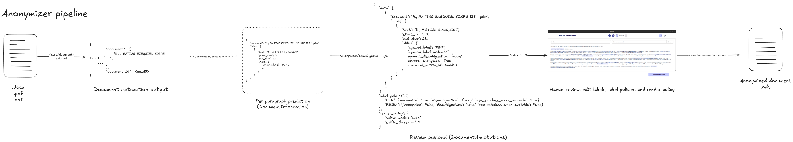

# Anonymizer Pipeline
Language: **English** | [Español](../../es/pipelines/anonymizer/README.md)

Workflow-oriented technical reference for anonymization.

## Scope
This flow extracts entities from judicial text and compiles anonymized output documents.

## Diagram

Editable source: [pipeline.excalidraw](pipeline.excalidraw)

## Runtime entrypoints
- `POST /misc/document-extract`
- `POST /anonymizer/predict`
- `POST /anonymizer/disambiguate`
- `POST /anonymizer/validation`
- `POST /anonymizer/anonymize-document`

## Step-by-step flow
1. Text extraction (`/misc/document-extract`) splits source document into normalized paragraphs.
2. Prediction (`/anonymizer/predict`) runs NER on each paragraph.
3. Disambiguation (`/anonymizer/disambiguate`) assigns canonical entity IDs and effective anonymization/disambiguation metadata.
4. Manual review in UI edits labels and optional policies.
5. Compilation (`/anonymizer/anonymize-document`) applies replacements and exports anonymized `.odt`.

## Technical components

### Pipeline configuration
- Source: `resources/pipelines/production/flair-anonymizer/pipeline.json`
- Preprocess:
  - `aymurai.models.flair.utils.FlairTextNormalize`
- Model:
  - `aymurai.models.flair.core.FlairModel`
  - base model path: `aymurai/anonymizer-beto-cased-flair`
- Postprocess:
  - `aymurai.transforms.anonymization_postprocess.core.AnonymizationEntityCleaner`
  - `aymurai.transforms.datetime_formatter.core.DatetimeFormatter`

### API contracts used by this flow
- `DocumentInformation`
- `DocumentAnnotations`
- `LabelPolicy`
- `RenderPolicy`
- `EntityAttributes` (notably: `canonical_entity_id`, `aymurai_label_instance`, `aymurai_disambiguation`, `aymurai_anonymize`)

### Core backend modules
- Router: `aymurai/api/endpoints/routers/anonymizer/anonymizer.py`
- Rendering: `aymurai/text/anonymization/docx.py` and `aymurai/text/anonymization/pdf.py`
- Canonical entity mapping: `aymurai/utils/entity_disambiguation/`

## Persistence (DB)
Tables touched by this flow:
- `anonymization_paragraph`
- `anonymization_document`
- `anonymization_document_paragraph`

## Notes
- Label policies are merged from environment and request payload.
- Render policy controls suffix behavior (`auto`, `always`, `never`) during replacement.

## Related docs
- Pipelines index: [../README.md](../README.md)
- Anonymizer entities: [../../entities/anonymizer/README.md](../../entities/anonymizer/README.md)
- Anonymizer model card: [../../models/anonymizer-model-card.md](../../models/anonymizer-model-card.md)
- API reference: [../../api/README.md](../../api/README.md)
- Internal database: [../../database/README.md](../../database/README.md)
