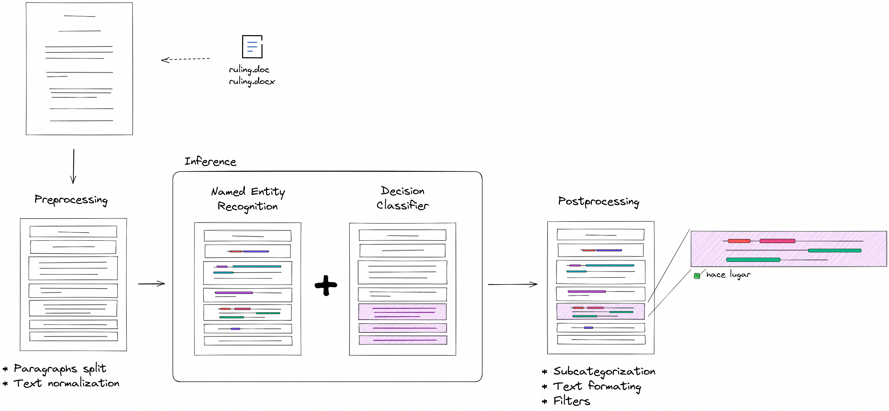

# Datapublic Pipeline
Language: **English** | [Español](../../es/pipelines/datapublic/README.md)

Workflow-oriented technical reference for the datapublic information extraction flow.

## Scope
This flow extracts structured information from paragraphs and supports document-level validation persistence for public dataset curation.

## Diagram

## Runtime entrypoints
- `POST /api/misc/document-extract`
- `POST /api/datapublic/predict/{document_id}`
- `GET /api/datapublic/validation/document/{document_id}`
- `POST /api/datapublic/validation/document/{document_id}`

## Step-by-step flow
1. Text extraction (`/api/misc/document-extract`) splits source document into normalized paragraphs.
2. Prediction (`/api/datapublic/predict/{document_id}`) processes each paragraph and returns predictions; cache persistence happens only when `use_cache=true` (default).
3. UI review aggregates document-level validated output.
4. Validation read/write endpoints persist and retrieve document-level validation payload.

## Technical components

### Pipeline configuration
- Source: `resources/pipelines/production/datapublic/pipeline.json`
- Preprocess:
  - `aymurai.models.flair.utils.FlairTextNormalize`
- Models:
  - `aymurai.models.flair.core.FlairModel` (`aymurai/flair-ner-spanish-judicial`)
  - `aymurai.models.decision.binregex.DecisionEmbeddingBagBinRegex` (`return_only_with_detalle=true` in production)
- Postprocess:
  - `aymurai.transforms.entity_subcategories.regex.RegexSubcategorizer`
  - `aymurai.transforms.datetime_formatter.core.DatetimeFormatter`
  - `aymurai.transforms.entity_subcategories.sentence_transformer.SentenceTransformerSubcategorizer` (4 configured instances in production for `CONDUCTA`, `CONDUCTA_DESCRIPCION`, `DETALLE`, and `OBJETO_DE_LA_RESOLUCION`)
  - `aymurai.transforms.entity_subcategories.article.ArticleSubcategorizer`

### Algorithms and processing notes
- NER extraction over judicial paragraphs.
- Decision filtering/classification for relevance, gated in production so `DECISION` is emitted only when a `DETALLE` entity is already present.
- Rule-based + embedding-based subcategorization.
- Date/time normalization and article-based subcategory mapping.

### API contracts used by this flow
- `TextRequest`
- `DocumentInformation`
- `DataPublicDocumentAnnotations` (free-form document-level validation payload)

### Core backend modules
- Router: `aymurai/api/endpoints/routers/datapublic/datapublic.py`
- Pipeline loading and inference: datapublic predict route in `aymurai/api/endpoints/routers/datapublic/datapublic.py`

## Persistence (DB)
Tables touched by this flow:
- `datapublic_paragraph`
- `datapublic_document`
- `datapublic_document_paragraph`

## Notes
- Current production pipeline directory name is `datapublic`.
- `document_id` is the document-level grouping key used to associate paragraph predictions and validation payloads.
- Validation persistence is document-level and intentionally accepts a free-form JSON object.
- `GET /api/datapublic/validation/document/{document_id}` returns `404` when the document does not exist; `POST` upserts the validation payload.
- Public router currently does not mount `/api/datapublic/dataset/*` routes.
- Paragraph-level validation route exists in code as commented legacy logic and is not part of the public flow.

## Models used by this flow
- Flair NER: [../../models/flair-model-card.md](../../models/flair-model-card.md)
- Decision classifier: [../../models/decision-model-card.md](../../models/decision-model-card.md)

## Related docs
- Pipelines index: [../README.md](../README.md)
- Datapublic entities: [../../entities/datapublic/README.md](../../entities/datapublic/README.md)
- API reference: [../../api/README.md](../../api/README.md)
- Internal database: [../../database/README.md](../../database/README.md)
